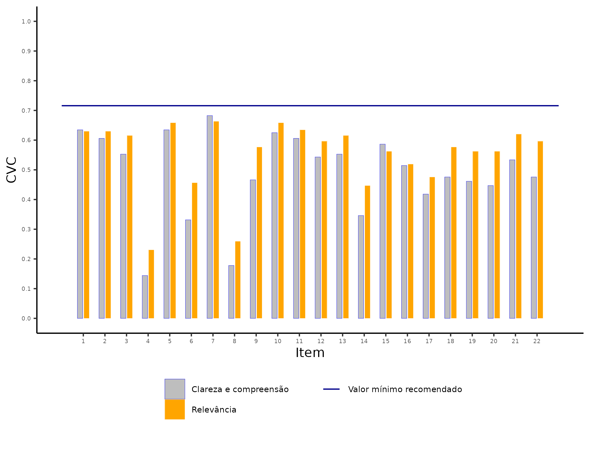

```{r setup, include=FALSE}
knitr::opts_chunk$set(echo = FALSE, cache = TRUE, fig.align = "center", out.width = "75%", fig.pos = "htbp", warning = FALSE)
library(openxlsx)
library(psych)
library(readxl)
library(tidyverse)
```

\onehalfspacing

  \begin{titlepage}
    \drop=0.1\textheight
    \centering
    \vspace*{\baselineskip}
    \rule{\textwidth}{1.6pt}\vspace*{-\baselineskip}\vspace*{2pt}
    \rule{\textwidth}{0.4pt}\\[\baselineskip]
    {\LARGE RELATÓRIO FINAL \\ 
    \vspace*{\baselineskip}
    VALIDAÇÃO DE ESCALA DE CONHECIMENTO, ATITUDES E PRÁTICAS DE PROFESSORES SOBRE O TRANSTORNO DO ESPECTRO AUTISTA -- FASE 2}\\[0.2\baselineskip]
    \rule{\textwidth}{0.4pt}\vspace*{-\baselineskip}\vspace{3.2pt}
    \rule{\textwidth}{1.6pt}\\[\baselineskip]
    \scshape
    Trabalho de consultoria realizado no contexto da ação de extensão da Universidade Federal da Bahia com título \textit{Consultoria Estatística}. \\
    \vspace*{2\baselineskip}
    Elaborado por \\[\baselineskip]
    {\Large Gilberto Pereira Sassi\par}
    \vfill
    {\scshape 2021} \\
    {\large Universidade Federal da Bahia}\\
    {\large Instituto de Matemática e Estatística}\\
    {\large Departamento de Estatística}\par
  \end{titlepage}

\newpage

\tableofcontents

\newpage

# Introdução

Este relatório apresenta os resultados da análise estatística do conjunto de dados referente à seguinte consultoria:

* **Consulente:** Danilo de Assis Pereira;
* **Título do projeto:** Validação de escala de conhecimento, atitudes e práticas de professores sobre transtorno do espectro autista.

# Materiais e métodos

O consulente pediu apoio no sexto passo do polo teórico na validação de conteúdo da escala de _conhecimento, atitude e prática _ do modelo psicométrico proposto por @pasquali1999elaboraccao. Nesta consultoria, construimos três gráficos:

1. Gráfico do Coeficiente de Validade de Conteúdo em relação à clareza/compreensão e relevância dos itens;
1. Gráfico de distribuição de concordância entre os juízes  usando o coeficiente de Kappa [@fleiss1981measurement];


Todas as computações e gráficos foram construídas usando a linguagem `R` [@Rlang].

## Cálculo do Coeficiente de Validade de Conteúdo

Primeiramente, eu usei a seguinte codificação para calcular o Coeficiente de Validade de Conteúdo (CVC) para a análise de _clareza e compreensão_:

1. _nada claro_ corresponde ao valor 1;
2. _pouco claro_ corresponde ao valor 2;
3. _muito claro_ corresponde ao valor 3;
4. _totalmente claro_ corresponde ao valor 4;

E para a análise de _relevância_, eu usei a seguinte codificação:

1. _nada relevante_ corresponde ao valor 1;
2. _pouco relevante_ corresponde ao valor 2;
3. _muito relevante_ corresponde ao valor 3;
4. _totalmente relevante_ correspondeo ao valor 4.


Para computar o Coeficinte de Validade Conteúdo para o item em um instrumento com $I$ itens avaliado por $J$ juízes, usamos o seguinte algoritmo:

1. Calcular a nota média do item $i$: $\bar{x}_i = \frac{\sum_{j=1}^{J}x_j}{J}$;
1. Penalização de vieses dos juízes: $P_i = \frac{1}{J}$;
1. Calcular o Coeficiente de Validade do Conteúdo do $i$-ésimo item: $CVC_i = \frac{\bar{x}_i}{\max{\{x_1, \dots, x_J\}}} - P_i$;
1. Finalmente, o Coeficiente de Validade do instrumento é dado por: $CVC_t = \frac{\sum_{i=1}^{I}CVC_i}{I}$.

O instrumento do consulente tem $I = 22$ itens e foram consultados $J = 52$ juízes.

Todos os cálculos desta seção seguiram as instruções e orientações de @firmiano2017escala disponbilizadas pelo consulente.

\newpage

# Resultados

Nesta seção, vou incluir os resultados preliminares obtidos.

## Gráfico do Coeficiente de Validade de Conteúdo em relação à clareza/compreensão e relevância dos itens (primeira versão)

Na Figura \@ref(fig:grafico2V1), incluimos o gráfico com o coeficiente CVC de clareza/compreensão e com o coeficiente de CVC de relevância para cada item. Além disso, incluímos o valor de referência recomendando por @hernandez2002contributions que é $0,98$. Esse valor é alto, e por isso sugiro usar $75\%$ de $\left(1 - \frac{1}{52}\right) \cdot 0,75 = 0,74$.

```{r grafico2V1, fig.cap="Gráfico de distribuição das características dos juízes.", out.width="90%"}
knitr::include_graphics("../figures/grafico2_0_8.png")
```

\newpage

## Gráfico do Coeficiente de Validade de Conteúdo em relação à clareza/compreensão e relevância dos itens (segunda versão)

Na Figura \@ref(fig:grafico2V2), incluimos o gráfico com o coeficiente CVC de clareza/compreensão e com o coeficiente de CVC de relevância para cada item. Além disso, incluímos o valor de referência $0,6$. Como a amostra tem 52 juízes, o valor máximo do coeficiente CVC é $1-\frac{1}{52}\approx 0,98$ para esta amostra de juízes. Esse valor é alto, e por isso sugiro usar $75\%$ de $\left(1 - \frac{1}{52}\right) \cdot 0,75 = 0,74$.

```{r grafico2V2, fig.cap="Gráfico de distribuição das características dos juízes.", out.width="90%"}

```

\cleardoublepage

# Referências
